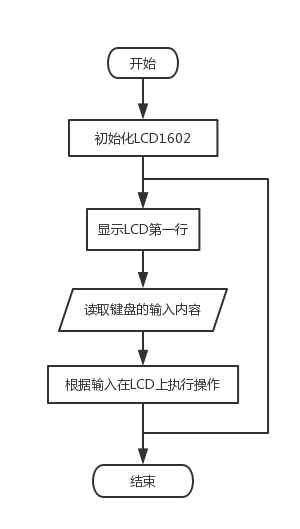
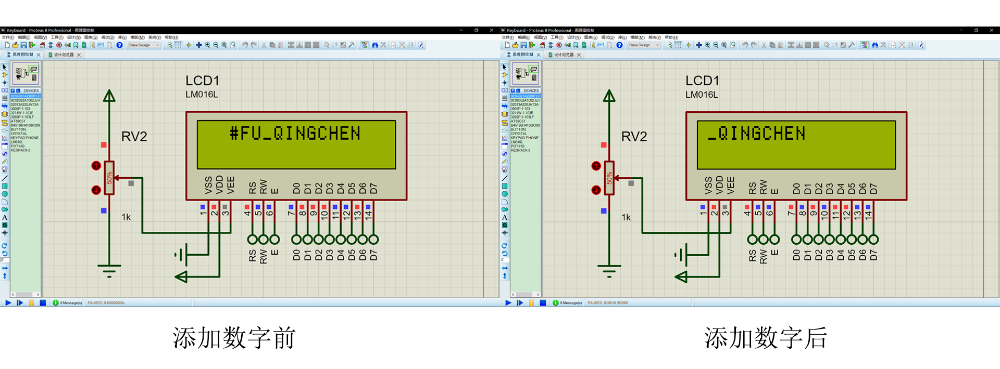
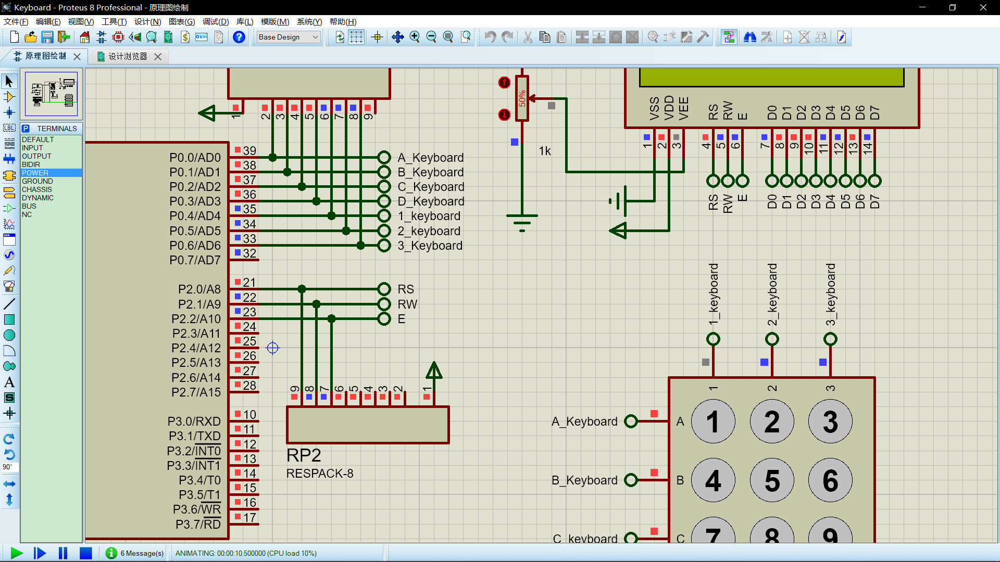
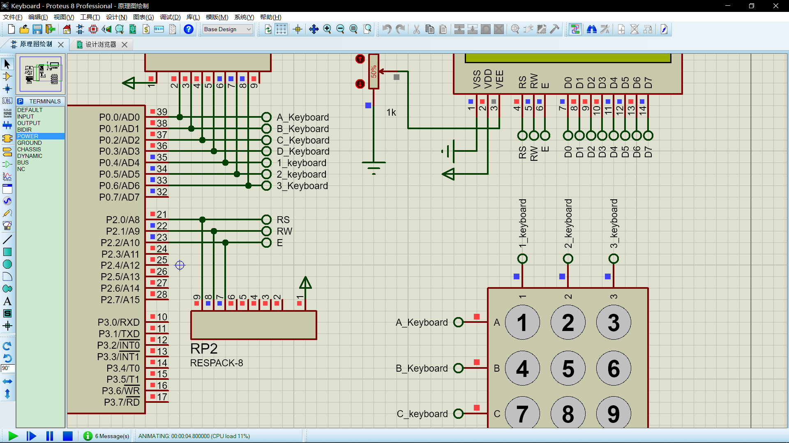
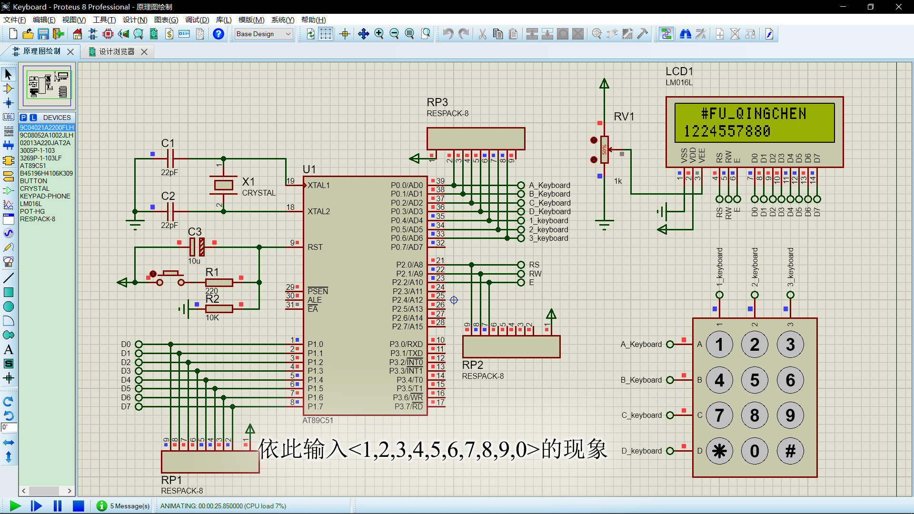

# 实验要求

设计一个模拟电话拨号的显示装置，即把电话键盘中拨出的某一电话号码， 显示在LCD显示屏上。电话键盘共有12个键，除了0~9的10个数字键外，还有“*”键用于实现删除功能，即删除位最后输人的号码;“#” 键用于清除显示屏上所有的数字显示。还要求每按下一个键要发出声响，以表示按下该键。

# 实验原理

本题目涉及单片机与4x 3矩阵式键盘的接口设计以及与16x 2的液晶显示屏的接口设计，以及如何驱动蜂鸣器。液晶显示屏采用LM016L(LCD1602)LCD,显示共2行，每行16个字符。第1行为设计者信息，第2行开始显示所拨的电话号码，最多为16位(因为LCD的-行能显示16个字符)。

# 系统电路的设计

## 电路原理图


## 电子元器件型号和数量

|      名称       | 数量 |    位号    |
| :-------------: | :--: | :--------: |
| 9C04021A2200FLH |  1   |     R1     |
| 9C08052A1002JLH |  1   |     R2     |
| 02013A220JAT2A  |  2   |   C1,C2    |
|     AT89C51     |  1   |     U1     |
|     CRYSTAL     |  1   |     X1     |
| B45196H4106K309 |  1   |     C3     |
|     BUTTON      |  1   |     -      |
|  KEYPAD-PHONE   |  1   |     -      |
|     LM016L      |  1   |    LCD1    |
|     POT-HG      |  1   |    RV1     |
|    RESPACK-8    |  3   | RP1,RP2,RP |
|     SOUNDER     |  1   |    LS1     |

## 电路工作原理的重点说明


# 系统控制程序的设计

## 控制程序的工作流程图



## 控制程序源代码

```c
/*************************************************
* @Author: fuqingchen@whut.edu.cn
* @Date: 2018-11-12 20:06:29
* @Description: 电话键盘&拨号的模拟
*************************************************/

#include <reg51.h>
#include <intrins.h>
#include <string.h>
#define KEY P0	//分别读取A,B,C,D,1,2,3
#define LCD P1	//分别控制D0,D1,D2,D3,D4,D5,D6,D7
sbit SPEAKER = P3 ^ 7;	//控制蜂鸣器
sbit RS = P2 ^ 0;	//控制RS
sbit RW = P2 ^ 1;	//控制RW
sbit E  = P2 ^ 2;	//控制E
unsigned char str[16];	//LCD1602第二行输出内容

/*************************************************
* @Description: 延时函数
* @Input: t:延长的时间
*************************************************/
void delay(unsigned int t) {
	unsigned char i;
	while (t--) {
		for (i = 0; i<120; i++);
	}
}

/*************************************************
* @Description: 蜂鸣器发声
*************************************************/
void show_speaker() {
	unsigned char sound;
	for (sound = 0; sound < 50; sound++)
	{
		SPEAKER = 0;
		delay(1);
		SPEAKER = 1;
		delay(1);
	}
}

/*************************************************
* @Description: LCD1602读状态(查忙)
*************************************************/
void check_busy_LCD() {
	unsigned char pin;
	do
	{
		pin = 0xff;
		E = 0;
		RS = 0; RW = 1; E = 1;	//LCD读状态控制信号
		pin = LCD;
	} while (pin & 0x80);
	E = 0;
}

/*************************************************
* @Description: LCD1602写命令
* @Input: com:要写入的命令
*************************************************/
void write_command_LCD(unsigned char com) {
	check_busy_LCD();
	RS = 0; RW = 0;	//LCD写命令控制信号
	E = 0; LCD = com; E = 1;	//写命令正脉冲
	_nop_(); E = 0; delay(1);
}

/*************************************************
* @Description: LCD1602写数据
* @Input: date:要写入的数据
*************************************************/
void write_data_LCD(unsigned char date) {
	check_busy_LCD();
	RS = 1; RW = 0;	//LCD写数据控制信号
	E = 0; LCD = date; E = 1;	//写数据正脉冲
	_nop_(); E = 0; delay(1);
}

/*************************************************
* @Description: LCD1602初始化
*************************************************/
void initial_LCD() {
	write_command_LCD(0x38);	//两行显示，5*7点阵，8位数据接口
	_nop_();
	write_command_LCD(0x0C);	//整体显示，光标关，无显示
	_nop_();
	write_command_LCD(0x04);	//整屏不移位
	_nop_();
	write_command_LCD(0x01);	//显示清屏
}

/*************************************************
* @Description: LCD1602显示字符串
* @Input: address:字符串位置;*s:字符串;length:字符串长度
*************************************************/
void show_string_LCD(unsigned char address, unsigned char *s, unsigned int length) {
	unsigned int i;
	write_command_LCD(address);
	delay(5);
	for (i = 0; i < length; i++)
	{
		write_data_LCD(*(s + i));
	}
}

/*************************************************
* @Description: 根据输入在LCD上的操作
* @Input: no:读取的键盘字符[0,1,2,3,4,5,6,7,8,9,*,#]
*************************************************/
void get_No(int no) {
	char str2;
	if (no < 10)	//输入数字时，加一位数字
	{
		str2 = no + 48;	//将no给str2,48为ASCII码
		if (strlen(str)<16)
		{
			strcat(str, &str2);	//加一位数字
		}
	}
	else if (no == 10)	//输入 * 时，去一位数字
	{
		write_command_LCD(0x01);	//显示清屏
		delay(5);
		show_string_LCD(0x82, "#FU_QINGCHEN", 12);
		*(str + strlen(str) - 1) = 0;
		*(str + strlen(str)) = 0;
	}
	else    //输入 # 时，清屏
	{
		*str = 0;
		write_command_LCD(0x01);	//显示清屏
		delay(5);
		show_string_LCD(0x82, "#FU_QINGCHEN", 12);
		_nop_();
		delay(500);
	}
	show_string_LCD(0xC0, str, strlen(str));
	delay(5);
}

/*************************************************
* @Description: 输入 # 时清屏
*************************************************/
void get_sign() {
	//write_command_LCD(0x01);	//显示清屏
	delay(50);
	show_string_LCD(0x82, "#FU_QINGCHEN", 12);
	_nop_();
	delay(100);
}

/*************************************************
* @Description: 读取键盘的输入内容
*************************************************/
void getKeyValue() {
	int i;
	unsigned char R;	//行扫描值
	unsigned char C;	//列扫描值
	unsigned char RC;	//坐标
	unsigned char code_key;
	KEY = 0x0F;	//ABCD取高电平，123取低电平
	if (KEY!=0x0F)	//KEY出现变化说明输入
	{
		//delay(15);	//去抖动
		if ((KEY|0xF0)!=0xFF)
		{
			show_speaker();
			R = (~KEY) & 0x0F;	//获取行值
			code_key = 0xEF;
			C = 0x10;
			for (i = 0; i < 3; i++)
			{
				KEY = code_key;
				if ((KEY|0xF0)!=0xFF)
				{
					RC = R | C;
					switch (RC)
					{
					case 0x28:get_No(0); break;
					case 0x11:get_No(1); break;
					case 0x21:get_No(2); break;
					case 0x41:get_No(3); break;
					case 0x12:get_No(4); break;
					case 0x22:get_No(5); break;
					case 0x42:get_No(6); break;
					case 0x14:get_No(7); break;
					case 0x24:get_No(8); break;
					case 0x44:get_No(9); break;
					case 0x18:get_No(10); break;
					case 0x48:get_No(11); break;
					}
					break;
				}
				code_key = _crol_(code_key, 1);
				C = _crol_(C, 1);
			}
		}
	}
}

void main() {
	initial_LCD();
	while (1)
	{
		get_sign();
		getKeyValue();
		//write_command_LCD(0x01);	//清屏
		delay(100);
	}
}
```

# 系统的调试和结果

要求包括内容：系统调试的方法，系统正确运行的照片或图片(必须包括整个工作过程的图片)并作简要说明。

# 实验过程中所遇到的问题，解决方法和建议

##   【C语言语法】变量的申明

### 问题

我一开始的循环是这样写的：

```c
for (int i = 0; i < length; i++){
    //Do Some Thing
}
```

但是我发现标准C语言不支持临时变量在for循环中定义

### 解决方法

在函数的开始申明变量，之后再使用变量

```c
int i;
for (i = 0; i < length; i++){
    //Do Some Thing
}
```
## 【LCD1602】显示器字符的去除

### 问题

写字符串的函数

```c
/*************************************************
* @Description: LCD1602显示字符串
* @Input: address:字符串位置;*s:字符串;length:字符串长度
*************************************************/
void show_string_LCD(unsigned char address, unsigned char *s, unsigned int length) {
	unsigned int i;
	write_command_LCD(address);
	delay(5);
	for (i = 0; i < length; i++)
	{
		write_data_LCD(*(s + i));
	}
}
```

只能对LCD1602上面的字符进行改变，但是无法删除。

### 解决方法

当有删除字符的操作时，先**清除屏幕内容**，再**加载删除后的内容**。

## 【LCD1602】屏幕的移动

### 问题

按照课本上的代码，每当我输入一个字符时，整个屏幕都会向左移动。但是按照要求，第1行为设计者信息，这个是不希望移动的，第二行是可以移动的



### 解决方法

在LCD1602初始化时，**设置为整屏不移动**，以保持第一行正常移动；记录每次输入值，**通过软件算法给出需要显示在LCD上的数字**，实现第二排的移动。

- 更改LCD1602初始化设置

  ```c
  /*************************************************
  * @Description: LCD1602初始化
  *************************************************/
  void initial_LCD() {
  	write_command_LCD(0x38);	//两行显示，5*7点阵，8位数据接口
  	_nop_();
  	write_command_LCD(0x0C);	//整体显示，光标关，无显示
  	_nop_();
  	write_command_LCD(0x04);	//整屏不移位
  	_nop_();
  	write_command_LCD(0x01);	//显示清屏
  }
  ```

- 通过软件算法给出需要显示在LCD第二排的内容

  ```c
  /*************************************************
  * @Description: 根据输入在LCD上的操作
  * @Input: no:读取的键盘字符[0,1,2,3,4,5,6,7,8,9,*,#]
  *************************************************/
  void get_No(int no) {
  	char str2;
  	if (no < 10)	//输入数字时，加一位数字
  	{
  		str2 = no + 48;	//将no给str2,48为ASCII码
  		if (strlen(str)<16)
  		{
  			strcat(str, &str2);	//加一位数字
  		}
  	}
  	else if (no == 10)	//输入 * 时，去一位数字
  	{
  		write_command_LCD(0x01);	//显示清屏
  		delay(5);
  		show_string_LCD(0x82, "#FU_QINGCHEN", 12);
  		*(str + strlen(str) - 1) = 0;
  		*(str + strlen(str)) = 0;
  	}
  	else    //输入 # 时，清屏
  	{
  		*str = 0;
  		write_command_LCD(0x01);	//显示清屏
  		delay(5);
  		show_string_LCD(0x82, "#FU_QINGCHEN", 12);
  		_nop_();
  		delay(500);
  	}
  	show_string_LCD(0xC0, str, strlen(str));
  	delay(5);
  }
  ```

## 【Proteus】接口序号

### 问题

按照电路图， `1_keyboard ` 引脚应该为**低电平**。但是测试时出现了 `1_keyboard ` 引脚点位不明确的现象



### 解决方法

将`AT89C51`上的接口名称由`1_keyboard` 改为`1_keyboard ` (在后面多一个空格)



## 【C语言程序】3列与2列相同

### 问题

当键盘按下第三列的键（`3`、`6`、`9`、`#`）时，读取的不是第三列的值而是第二列的值。



### 解决方法

1. 检查电路图：重新绘制一个电路之后现象跟原先一样，排除电路图有问题的可能

2. 检查源程序：
