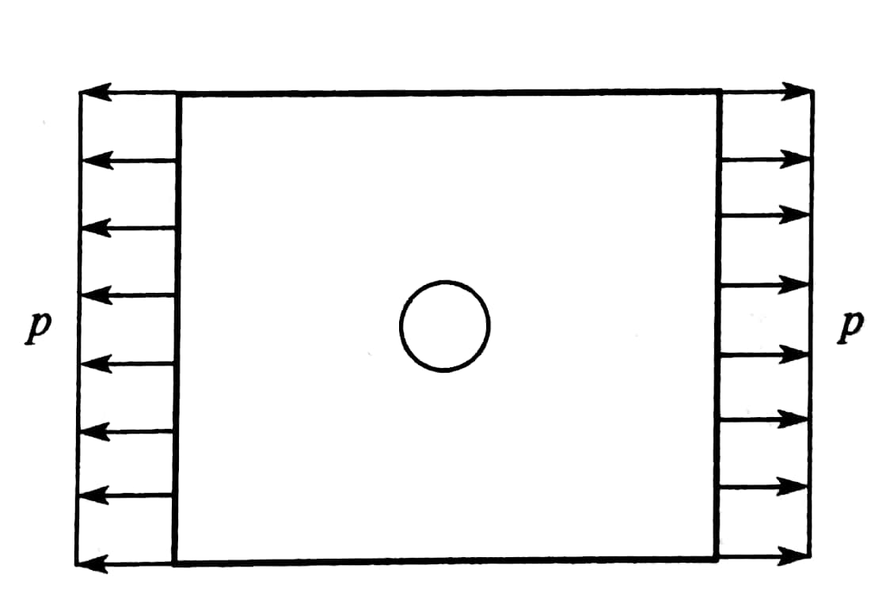
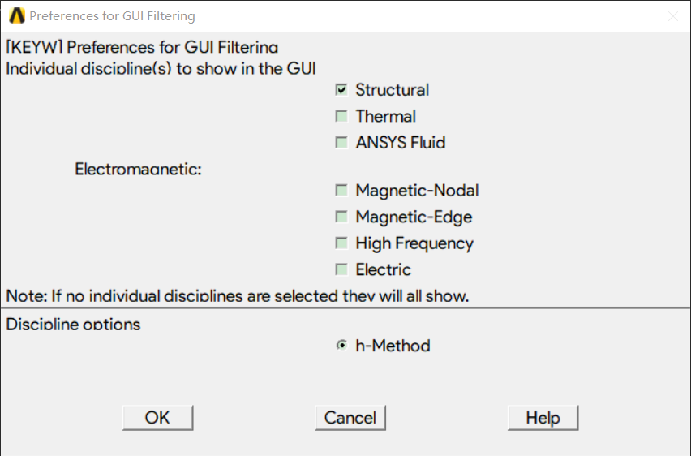
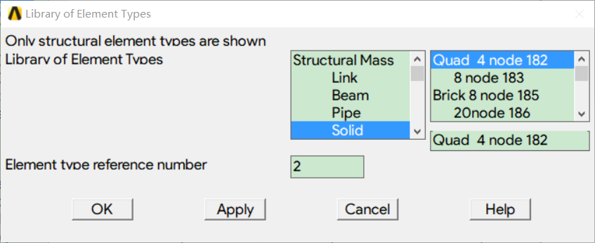
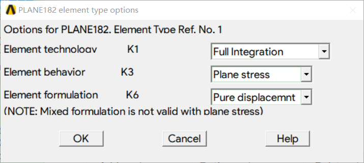
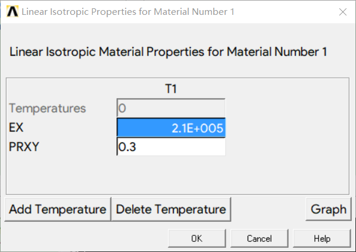
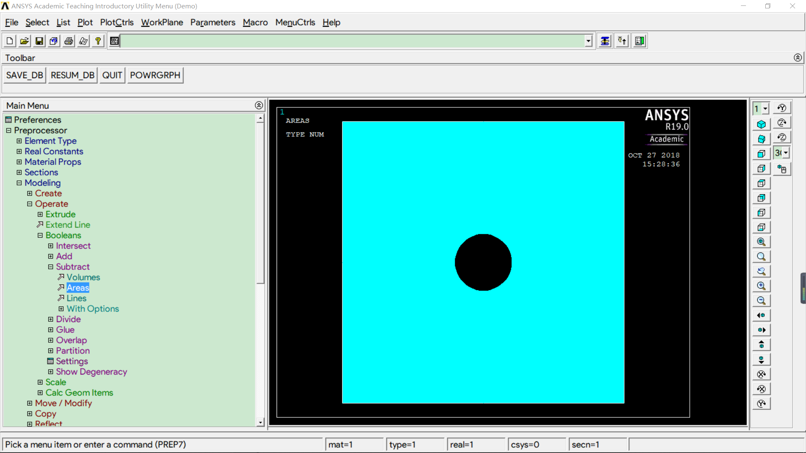
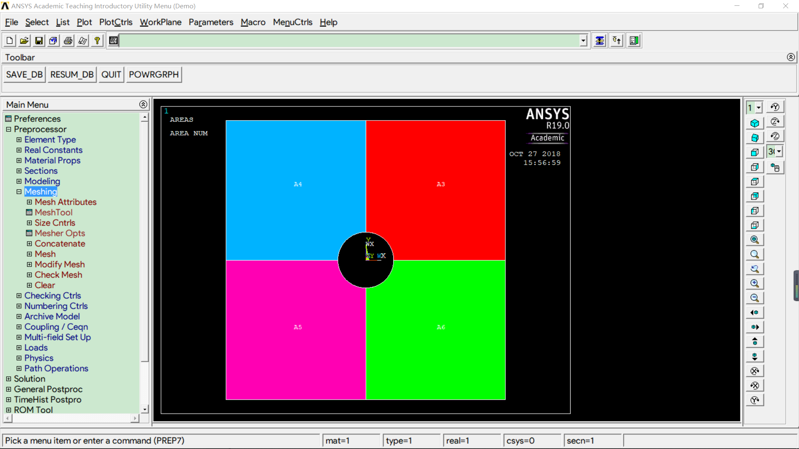
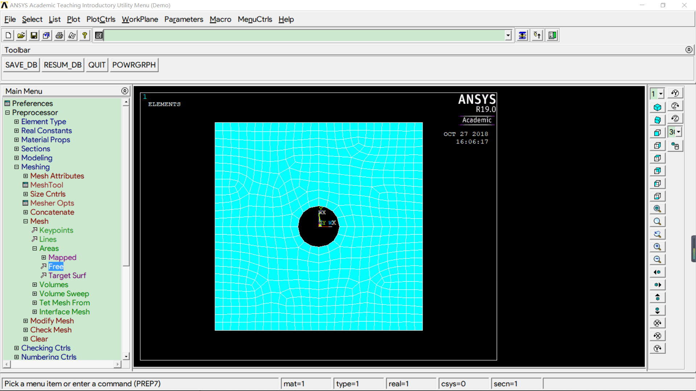
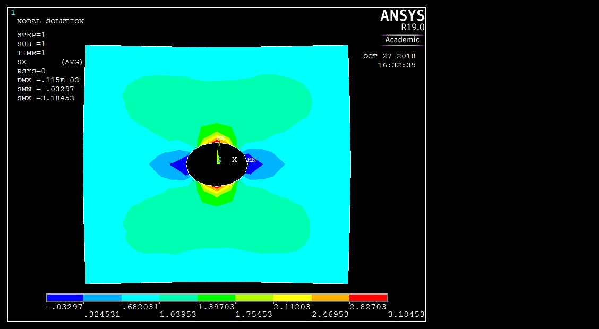

# 3.5

如图所示，正方形簿板边长40mm，厚1mm；中心有圆孔，半径r＝4mm；正方形的一对边受均匀单向拉力p＝1MPa。已知E＝2.1×105MPa，μ＝0.3，试求两对称面上的正应力峰值及变化规律

------

# 1.设置单元类型及材料属性

1.【Preferences】选【结构】

2.设置单元类型为固体，并选择平面应力问题

3.设置材料属性，选择线性-弹性-各向同性，设置E、μ

# 2.建立几何模型

1.生成矩形、圆并进行布尔运算

2.把中间的划开，生成有限元网格

3.添加载荷

# 3.读取结果

