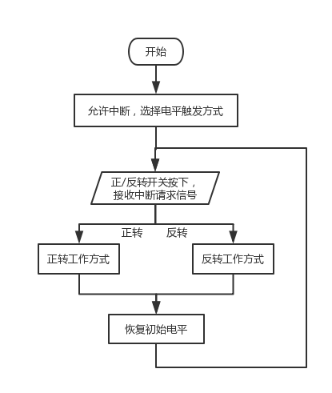

# 实验要求

利用单片机实现对步进电机的控制，编写程序，用4路I/O口实现环形脉冲的分配，控制步进电机按固定方向连续转动。同时，要求按下“Positive（正转）”按键时，控制步进电机正转；按下“Negitive（反转）”按键时，控制步进电机反转；松开按键时，电机停止转动。通过“正转”和“反转”两个按键，来控制电机的正转与反转。

# 实验原理

对步进电机的驱动，是通过对步进电机每组线圈中的电流的顺序切换来使电机作步进式旋转。切换是通过单片机输出脉冲信号来实现的。所以调节脉冲信号的频率就可以改变步进电机的转速，改变各相脉冲的先后顺序，就可改变电机的转向。步进电机的转速应由慢到快。

# 系统电路的设计

## 电路原理图


## 电子元器件型号和数量

|      名称       | 数量 |    位号    |
| :-------------: | :--: | :--------: |
| 9C04021A2200FLH |  1   |     R1     |
| 9C08052A1002JLH |  1   |     R2     |
| 02013A220JAT2A  |  2   |   C1,C2    |
|     AT89C51     |  1   |     U1     |
| B45196H4106K209 |  1   |     C3     |
|     BUTTON      |  3   |     -      |
|     CRYSTAL     |  1   |     X1     |
|  MOTOR-STEPPER  |  1   |     -      |
|    RESPACK-8    |  3   | RP1,RP2,RP |
|    ULN2003A     |  1   |     U2     |

## 电路工作原理的重点说明

### 时钟电路与复位电路

电容C1，C2与晶振片X1并联接在XTAL1，XTAL2上，构成时钟电路

电容C3与按钮及电阻R1并联接在RST上，构成复位电路

### 按钮控制模块

按钮POSITIVE，NEGITIVE分别接在INT0，INT1上，通过P3.3，P3.4读取中断请求信号

### 步进电机控制模块

步进电机的4个接口分别通过驱动设备ULN2003A接在P0口，通过P0控制步进电机的前进后退

# 系统控制程序的设计

## 控制程序的工作流程图



## 控制程序源代码

```c
/*************************************************
* @Author: fuqingchen@whut.edu.cn
* @Description: 步进电机控制实验
*************************************************/

#include <reg51.h>
unsigned char turn[] = { 0x01,0x03,0x02,0x06,0x04,0x0C,0x08,0x09 };
unsigned int i = 0;

/*************************************************
* @Description: 延时函数
* @Input: t:延长的时间
*************************************************/
void delay(unsigned int t) {
	unsigned char i;
	while (t--) {
		for (i = 0; i<120; i++);
	}
}

/*************************************************
* @Description: 使步进电机正转
*************************************************/
void positive() interrupt 0 {
	//TODO:使步进电机正转
	i++;
	if (i>=8)
	{
		i = 0;
	}
	P0 = turn[i];
	delay(100);
	P0 = 0xff;
}

/*************************************************
* @Description: 使步进电机反转
*************************************************/
void negitive()  interrupt 2 {
	//TODO:使步进电机反转
	i--;
	if (i <= 0)
	{
		i = 7;
	}
	P0 = turn[i];
	delay(100);
	P0 = 0xff;
}

void main() {
	EA = 1;	//允许总中断
	EX0 = 1; EX1 = 1;	//允许外部中断0,1
	IT0 = 0; IT1 = 0;	//选择电平触发方式
	IP = 0;	//低优先级
	while (1) {
		delay(100);
	}
}
```

## 控制程序的重点说明

### 步进电机的控制

查询相关资料可得，Proteus中六线制步进电机接线如图所示


为了使步进电机运行平稳，此处采用单、双八拍方式即

正转：
$$
A\rightarrow AB\rightarrow B\rightarrow BC\rightarrow C\rightarrow CD\rightarrow D\rightarrow DA
$$
反转：
$$
AD\rightarrow D\rightarrow DC\rightarrow C\rightarrow CB\rightarrow B\rightarrow BA\rightarrow A
$$
通过上述原理可以得到步进电机控制代码

| 通电 |  1B  |  2B  |  3B  |  4B  | 代码 |
| :--: | :--: | :--: | :--: | :--: | :--: |
|  A   |  1   |  0   |  0   |  0   | 0x01 |
|  AB  |  1   |  1   |  0   |  0   | 0x03 |
|  B   |  0   |  1   |  0   |  0   | 0x02 |
|  BC  |  0   |  1   |  1   |  0   | 0x06 |
|  C   |  0   |  0   |  1   |  0   | 0x04 |
|  CD  |  0   |  0   |  1   |  1   | 0x0C |
|  D   |  0   |  0   |  0   |  1   | 0x08 |
|  DA  |  1   |  0   |  0   |  1   | 0x09 |

表中1B，2B，3B，4B对应电路图中U2的1B，2B，3B，4B

在程序中通过这个数组实现步进电机的运动。

### 中断的配置

```c
	EA = 1;	//允许总中断
	EX0 = 1; EX1 = 1;	//允许外部中断源0,1
	IT0 = 0; IT1 = 0;	//选择电平触发方式
	IP = 0;	//低优先级，这是书上写出的，我也跟着写了这句
```

# 系统的调试和结果

### 系统调试的方法

1. 在 Keil uVision 中将写好的控制程序编译生成 hex 文件
2. 在 Proteus 画好电路图后，将软件中的模拟单片机与生成的 hex 文件链接
3. 在 Proteus 中进行仿真，观察现象。
4. 若不满足要求，重新修改控制程序并生成 hex 文件

### 系统正确运行的图片

#### 初始状态


#### 按下POSITIVE按钮后


一小段时间内，步进电机顺时针旋转了42°（0-42°）


一小段时间内，步进电机顺时针旋转了124°（42°-166°）

#### 按下NEGITIVE按钮后


一小段时间内，步进电机逆时针旋转了162°（166°-4°）


一段时间内，步进电机逆时针旋转了49°（162°-211°）

# 实验过程中所遇到的问题，解决方法和建议

### 【程序】步进电机的控制

#### 问题描述

一开始每按一次开关，步进电机都会跳到初始位置，从初始位置开始旋转。

#### 解决方法

将中断函数中控制相位的变量设置为全局变量，两个中断函数公用同一个变量

```c
unsigned int i = 0;

void positive()  interrupt 2 {
    ......
    i++;
	......
	P0 = turn[i];
    ......
}

void negitive()  interrupt 2 {
	......
    i--;
    ......
	P0 = turn[i];
    ......
}
```

