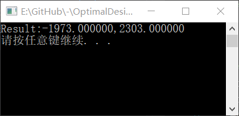
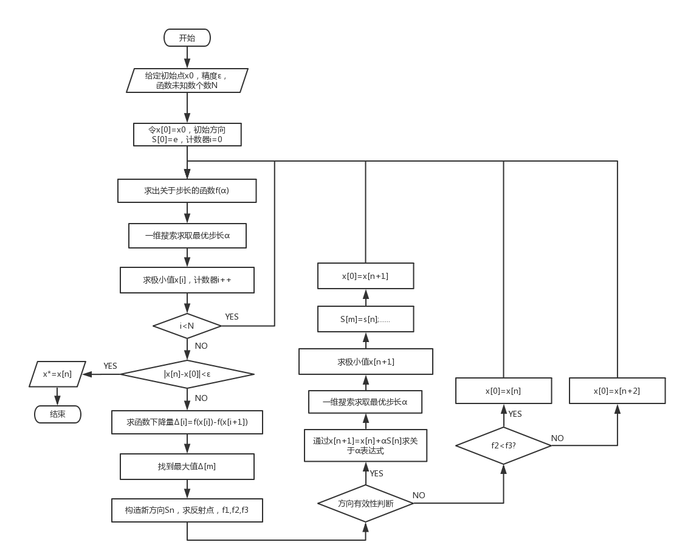
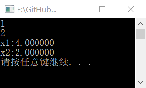

# 1. 进退法求解初始区间

实验日期：2018 年 11 月 8 日

## 1.1 实验目的

1. 加深对进退法的基本理论和算法步骤的理解。
2. 培养学生独立编制计算机程序的能力。
3. 掌握常用进退法程序的使用方法。

## 1.2 上机内容

### 1.2.1 算法概述

进退法用于求解一元函数 $f(\alpha)$ 极小点 $\alpha^*$ 所在区间 $[a,b]$ 。假设函数 $f(\alpha)$ 为单态函数，根据单态区间的性质，为了确定极小点 $\alpha^*$ 所在区间 $[a,b]$ ，应使函数 $f(\alpha)$ 在 $[a,b]$ 区间形成 “高—低—高” 趋势。

其算法为：从某给定初值 $\alpha_0$ 开始，以初始步长 $h$ 向前试探。如果函数值上升，则步长变号，即改变试探方向；如果函数值下降，则维持原来的试探方向。区间的始点、中间点依次沿试探方向移动一步。此过程一直进行到函数值再次上升时为止，即可找到搜索区间的终点。最后得到的三点即为搜索区间的始点、中间点和终点，形成函数值的 “高—低—高” 趋势。

### 1.2.2 程序框图


### 1.2.3 源程序

```c
/*************************************************
* @Author: Fu_Qingchen
* @Date: 2018-11-7 
* @Description: 进退法求解区间
*************************************************/
#include<stdio.h>
#include<stdlib.h>
#define A0 1234
#define H 1069

/*************************************************
* @Description: 要找区间的函数
*************************************************/
double function(double x) {
	return (x * x + 15 * x + 1);
}

/*************************************************
* @Description: 进退法主函数
* @Input: a0:初始值,h:步长,*range:区间左右端点
* @Return: 区间左右端点
*************************************************/
void jintui(double a0, double h, double *range) {
	if (function(a0)==function(a0+h))
	{
		*(range) = a0;
		*(range + 1) = a0 + h;
	}
	else if (function(a0) > function(a0 + h))
	{
		*(range) = a0;
		do
		{
			a0 += h;
		} while (function(a0)>function(a0 + h));
		*(range + 1) = a0 + h;
	}
	else
	{
		*(range + 1) = a0 + h;
		do
		{
			a0 -= h;
		} while (function(a0)<function(a0 + h));
		*(range) = a0 - h;
	}
}

void main() {
	double a0 = A0, h = H;
	double range[2] = {0,0};
	jintui(a0, h, range);
	printf("Result:%f,%f\n", range[0], range[1]);
	system("pause");
}
```

## 1.3 过程分析

遇到的问题：

### 1.3.1 数组在函数中的传递

我发现C语言函数一般只能返回一个值，传递数组就比较麻烦

#### 解决方法

使用指针在函数之间传递数组

例如：主函数中，调用的 `jintui` 函数通过 `range` 传递区间左右两个端点值

```c
	double range[2] = {0,0};
	jintui(a0, h, range);
```

## 1.4 结果分析

给定函数：
$$
f(\alpha)=\alpha^2+15\alpha+1
$$
其理论极小点为 $\alpha^*=-7.5$ 

给定初值 $\alpha_0=1234$ ，给定步长 $h=1069$

结果：



所求区间 $[-1973.000000,2303.000000]$ 包含极小点 $\alpha=-7.5$ ，通过验证

# 2. 一维搜索法求解最优步长

实验日期：2018 年 11 月 15 日

## 2.1 实验目的

1. 加深对一维搜索方法的基本理论和算法步骤的理解。
2. 培养学生独立编制计算机程序的能力。
3. 掌握常用一维搜索方法程序的使用方法。

## 2.2 上机内容

### 2.2.1 算法概述

此处使用格点法进行求解。格点法用于通过给定区间 $[a,b]$ 求解函数极小点 $\alpha^*$ 。

其算法为：给定区间 $[a,b]$，将其等分为 $n+1$ 个区间 $(n\geq3)$，计算 $f(a_1),f(a_2)...f(a_n)$，找出其中的最小点 $f(a_m)=\min\{f(a_1),f(a_2)...f(a_n)\}$，$a_m$左右两点就构成搜索区间 $[a_{m-1},a_{m+1}]$，直至 $|a_{m+1}-a_{m-1}|\leq\varepsilon$ 

### 2.2.2 程序框图


### 2.2.3 源程序

```c
/*************************************************
* @Author: Fu_Qingchen
* @Date: 2018-10-30
* @Description: 格点法求解迭代步长
*************************************************/
#include<stdio.h>
#include<stdlib.h>
#define A0 999
#define H 10	//格点法步长
#define N 10 //格点法等分数
#define V 0.00001	//精度

/*************************************************
* @Description: 要找极小点的函数
*************************************************/
double function(double x) {
	return (x * x + 2 * x + 1);
}


/*************************************************
* @Description: 进退法主函数
* @Input: a0:初始值,h:步长,*range:区间左右端点
* @Return: 区间左右端点
*************************************************/
void jintui(double a0, double h, double *range) {
	if (function(a0) == function(a0 + h))
	{
		*(range) = a0;
		*(range + 1) = a0 + h;
	}
	else if (function(a0) > function(a0 + h))
	{
		*(range) = a0;
		do
		{
			a0 += h;
		} while (function(a0)>function(a0 + h));
		*(range + 1) = a0 + h;
	}
	else
	{
		*(range + 1) = a0 + h;
		do
		{
			a0 -= h;
		} while (function(a0)<function(a0 + h));
		*(range) = a0 - h;
	}
}


/*************************************************
* @Description: 平分区间[a,b]为(n+1)等分
* @Input: a:区间左端点,b:区间右端点,A:等分点数组
* @Return: A[i]
*************************************************/
void findA(double a, double b, double *A) {
	for (int i = 0; i < N; i++)
	{
		*(A + i) = (b - a) / (N + 1)*(i + 1) + a;
	}
}

/*************************************************
* @Description: 求数组最小值序号
* @Input: A:数组
* @Return: 最小值序号
*************************************************/
int findMin(double *A) {
	double tem = *(A + 0);
	int num = 0;
	for (int i = 0; i < N; i++)
	{
		if (tem > *(A+i))
		{
			num = i;
			tem = *(A + i);
		}
	}
	return num;
}

/*************************************************
* @Description: 格点法求解主要函数
* @Input: a:区间左端点,b:区间右端点,varepsilon：精度
* @Return: A[i]
*************************************************/
double geDian(double a, double b, double varepsilon) {
	int num;
	double A[N], F[N];	//A为等分的点，F为等分点的函数值
	do
	{
		findA(a, b, A);	//得到等分点
		for (int i = 0; i < N; i++)	//得到等分点对应函数值
		{
			F[i] = function(A[i]);
		}
		num = findMin(F);
		switch (num)	//迭代
		{
		case 0:b = A[num + 1]; break;
		case N:a = A[num - 1]; break;
        case N - 1:a = A[(num - 1)]; break;
		default:a = A[num - 1]; b = A[num + 1]; break;
		}
	} while (b - a > 0 ? ((b - a) > varepsilon) : ((a - b) > varepsilon));
	return 1.0 / 2 * (a + b);
}

void main() {
	double a0 = A0, h = H, range[2] = { 0,0 }, varepsilon = V, result;
	jintui(a0, h, range);
	result = geDian(range[0],range[1],varepsilon);
	printf("Result:%f\n", result);
	system("pause");
}
```

## 2.3 过程分析

遇到的问题

### 2.3.1 C语言与C++的区别

我的循环是这样写的：

```c
for (int i = 0; i < length; i++){
    //Do Some Thing
}
```

C++及Java等语言是支持这个的

但是我发现在【VC6.0】中的标准C语言不支持临时变量在for循环中定义

#### 解决方法

在函数的开始申明变量，之后再使用变量

```c
int i;
for (i = 0; i < length; i++){
    //Do Some Thing
}
```

### 2.3.2 数组的越界

当输入为一个很大的负数时，输出结果就会出现一个比较奇怪的数据

#### 解决方法

调试程序，分析异常数据，最后发现是在 `geDian` 函数中，`switch` 语句少考虑了一种情况，导致数组越界。

将 `geDian` 函数中：

```c
switch (num)	//迭代
		{
		case 0:a = a; b = A[num + 1]; break;
		case N:b = b; a = A[num - 1]; break;
		default:a = A[num - 1]; b = A[num + 1]; break;
		}
```

改为：

```c
switch (num)	//迭代
		{
		case 0:b = A[num + 1]; break;
		case N:a = A[num - 1]; break;
        case N - 1:a = A[(num - 1)]; break;
		default:a = A[num - 1]; b = A[num + 1]; break;
		}
```

成功解决问题

## 2.4 结果分析

给定函数：
$$
f(\alpha)=\alpha^2+2\alpha+1
$$
其理论极小点为 $\alpha^*=-1$ 

给定初值 $\alpha_0=999$ ，给定步长 $h=10$

结果：


所求极小点 $\alpha^*=-1.000000$ ，满足精度，通过验证

# 3. 求解多元函数的最优解

实验日期：2018 年 11 月 22 日，2018 年 11 月 29 日

## 3.1 实验目的

1. 加深对多元函数无约束优化方法的基本理论和算法步骤的理解。
2. 培养学生独立编制计算机程序的能力。
3. 掌握常用多元函数无约束优化方法程序的使用方法。

## 3.2 上机内容

### 3.2.1 算法概述

此处使用改进鲍威尔法进行求解。改进鲍威尔法用于求解多元函数函数极小点 $\alpha^*$ 。

其算法为：在每一轮迭代中总有个始点（第一轮的始点是任选的初始点）和 $n$ 个线性独立的搜索方向。从始点出发顺次沿 $n$ 个方向作一维搜索得一终点，由始点和终点决定了一个新的搜索方向。判断是否需要替换，若需要替换，用这个方向替换原来 $n$ 个方向中的一个，形成新的搜索方向组。这样就形成算法的循环。

替换的原则是去掉原方向组的第一个方向而将新方向排在原方向的最后。此外规定，从这一轮的搜索终点出发沿新的搜索方向作一维搜索而得到的极小点，作为下一轮迭代的始点。

### 3.2.2 程序框图



### 3.2.3 源程序

```c
/*************************************************
* @Author: Fu_Qingchen
* @Date: 2018-11-22
* @Description: 改进鲍威尔法无约束优化
*************************************************/
#include<stdio.h>
#include<stdlib.h>
#include<math.h>

#define A0	0	//给定初值1
#define A1	0	//给定初值2
#define V	0.000001	//给定精度

#define N	2	//函数变量个数
#define H	10	//格点法步长
#define N_1d	10	//格点法等分数-1
#define function_main(x1,x2) ((x1)*(x1)+2*(x2)*(x2)-4*(x1)-2*(x1)*(x2))	//要求解的函数

/*************************************************
* @Description: 进退法主函数
* @Input: a0:初始值,h:步长,*range:区间左右端点,*x:无约束问题的点，*S:搜索方向
* @Return: 区间左右端点
*************************************************/
void jintui(double a0, double h, double *range,double *x,double *S) {
	if (function_main(*(x)+a0*S[0],*(x+1)+a0*S[1]) == function_main(*(x)+(a0+h) * S[0], *(x + 1) + (a0+h) * S[1]))
	{
		*(range) = a0;
		*(range + 1) = a0 + h;
	}
	else if (function_main(*(x)+a0 * S[0], *(x + 1) + a0 * S[1]) > function_main(*(x)+(a0 + h) * S[0], *(x + 1) + (a0 + h) * S[1]))
	{
		*(range) = a0;
		do
		{
			a0 += h;
		} while (function_main(*(x)+a0 * S[0], *(x + 1) + a0 * S[1])>function_main(*(x)+(a0 + h) * S[0], *(x + 1) + (a0 + h) * S[1]));
		*(range + 1) = a0 + h;
	}
	else
	{
		*(range + 1) = a0 + h;
		do
		{
			a0 -= h;
		} while (function_main(*(x)+a0 * S[0], *(x + 1) + a0 * S[1])<function_main(*(x)+(a0 + h) * S[0], *(x + 1) + (a0 + h) * S[1]));
		*(range) = a0 - h;
	}
}

/*************************************************
* @Description: 平分区间[a,b]为(n+1)等分
* @Input: a:区间左端点,b:区间右端点,A:等分点数组
* @Return: A[i]
*************************************************/
void findA(double a, double b, double *A) {
	for (int i = 0; i < N_1d; i++)
	{
		*(A + i) = (b - a) / (N_1d + 1)*(i + 1) + a;
	}
}

/*************************************************
* @Description: 求数组最小值序号
* @Input: A:数组
* @Return: 最小值序号
*************************************************/
int findMin(double *A) {
	double tem = *(A + 0);
	int num = 0;
	for (int i = 0; i < N_1d; i++)
	{
		if (tem > *(A + i))
		{
			num = i;
			tem = *(A + i);
		}
	}
	return num;
}

/*************************************************
* @Description: 求数组最大值序号
* @Input: A:数组
* @Return: 最小值序号
*************************************************/
int findMax(double *A) {
	double tem = *(A + 0);
	int num = 0;
	for (int i = 0; i < N; i++)
	{
		if (tem < *(A + i))
		{
			num = i;
			tem = *(A + i);
		}
	}
	return num;
}

/*************************************************
* @Description: 格点法求解主要函数
* @Input: a:区间左端点,b:区间右端点,varepsilon:精度,*x:无约束问题的点，*S:搜索方向
* @Return: A[i]
*************************************************/
double geDian(double a, double b, double varepsilon,double *x, double *S) {
	int num;
	double A[N_1d], F[N_1d];	//A为等分的点，F为等分点的函数值
	do
	{
		findA(a, b, A);	//得到等分点
		for (int i = 0; i < N_1d; i++)	//得到等分点对应函数值
		{
			F[i] = function_main(*(x)+A[i] * S[0], *(x + 1) + A[i] * S[1]);
		}
		num = findMin(F);
		switch (num)	//迭代
		{
		case 0:b = A[(num + 1)]; break;
		case N_1d:a = A[(num - 1)]; break;
		case N_1d - 1:a = A[(num - 1)]; break;
		default:a = A[(num - 1)]; b = A[(num + 1)]; break;
		}
	} while (b - a > 0 ? ((b - a) > varepsilon) : ((a - b) > varepsilon));
	return 1.0 / 2 * (a + b);
}

/*************************************************
* @Description: 鲍威尔法求解主要函数
* @Input: *a0:初始点,varepsilon：精度
* @Return: *a0极小点
*************************************************/
int powell(double *a0, double varepsilon) {
	//设置初值
	double S[N+1][N+1] = { 0 };	//前进方向
	double S_new[N+1] = { 0 },sn1 = 0,sn2 = 0;	//构造的新方向
	double f[N + 1] = { 0 };	//迭代中的极小点
	double size[N] = { 0 };	//步长
	double delta[N] = { 0 };	//每前进一步的下降量
	int delta_max = 0;	//最大下降量对应序号
	double a00[N] = { 0 };	//初始点
	double a000[N] = { 0 };	//反射点
	double f1 = 0, f2 = 0, f3 = 0;	//方向有效性中的f1,f2,f3
	double h = H, range[2] = { 0,0 };	//一维搜索相关参数
	int i = 0, j = 0, k = 0;
	for (i = 0; i < N; i++)
	{
		S[i][i] = 1;
	}
	do
	{
		k++;
		printf("%d\n", k);
		f[0] = function_main(*(a0), *(a0 + 1));
		a00[0] = *(a0);
		a00[1] = *(a0 + 1);
		for (i = 0; i < N; i++)	//一维搜索
		{
			jintui(a0[i], h, range, a0, S[i]);
			size[i] = geDian(range[0], range[1], varepsilon, a0, S[i]);	//获取最优步长
			*(a0 + 0) = *(a0 + 0) + size[i] * S[i][0];	//获取极值点
			*(a0 + 1) = *(a0 + 1) + size[i] * S[i][1];
			f[i + 1] = function_main(*(a0), *(a0 + 1));	//获取极值点函数值
			delta[i] = f[i] - f[i + 1];
		}
		if (sqrt(pow(*(a0)-a00[0], 2) + pow(*(a0+1)-a00[1], 2))<varepsilon)	//收敛判断
		{
			return 0;
		}
		delta_max = findMax(delta);	//找到最大下降值
		for (i = 0; i < N; i++)
		{
			S_new[i] = *(a0 + i) - a00[i];	//构造新方向
			a000[i] = 2 * (*(a0 + i)) - a00[i];
		}
		sn1 = S_new[0];
		sn2 = S_new[1];
		f1 = f[0], f2 = f[N], f3 = function_main(a000[0], a000[1]);
		if (f3<f1 && ((f1 - 2 * f2 + f3)*pow(f1 - f2 - delta[delta_max], 2)<0.5*delta[delta_max] * pow(f1 - f3, 2)))	//方向有效
		{
			jintui(a0[0], h, range, a00, S_new);
			size[0] = geDian(range[0], range[1], varepsilon, a00, S_new);	//获取最优步长
			*(a0 + 0) = *(a00 + 0) + size[0] * S_new[0];	//获取极值点
			*(a0 + 1) = *(a00 + 1) + size[0] * S_new[1];
			f[0] = function_main(*(a0), *(a0 + 1));	//获取极值点函数值
			for (i = 0; i < N; i++)
			{
				if (i>=delta_max)
				{
					for ( j = 0; j < N; j++)
					{
						S[i - 1][j] = S[i][j];
					}
				}
			}
			S[N - 1][0] = sn1;
			S[N - 1][1] = sn2;
		}
		else	//方向无效
		{
			if (f3<f2)
			{
				*(a0 + 0) = a000[0];	//获取新初值
				*(a0 + 1) = a000[1];
			}
		}
	} while (1);
}

void main() {
	double a0[N], varepsilon = V;
	a0[0] = A0;
	a0[1] = A1;
	powell(a0, varepsilon);
	printf("x1:%lf\nx2:%lf\n", a0[0], a0[1]);
	system("pause");
}
```

## 3.3 过程分析

遇到的问题

### 3.3.1 参数的传递

在改进鲍威尔法中进行方向替换时，发现有一处一直替换不了

调试程序：`powell` 函数

```c
printf("%lf;%lf\n",S_new[0],S_new[1]);
for (i = 0; i < N; i++)
{
	if (i>=delta_max)
	{
		for ( j = 0; j < N; j++)
		{
			S[i - 1][j] = S[i][j];
		}
	}
}
printf("%lf;%lf\n",S_new[0],S_new[1]);
S[N - 1][0] = S_new[0];
S[N - 1][1] = S_new[1];
```

发现两次输出不一样

#### 解决方法

引入变量 `sn1` 和  `sn2` 通过它们来传递新方向

```c
double sn1 = 0,sn2 = 0;	//引入的新方向
...
sn1 = S_new[0];
sn2 = S_new[1];
...
for (i = 0; i < N; i++)
{
	if (i>=delta_max)
	{
		for ( j = 0; j < N; j++)
		{
			S[i - 1][j] = S[i][j];
		}
	}
}
S[N - 1][0] = sn1;
S[N - 1][1] = sn2;
```

### 3.3.2 原来代码的调用

通过一维搜索求步长时，发现一维搜索的函数总是改变的，因此无法直接套用之前的一维搜索方法

#### 解决方法

- 宏定义函数，这样就可以带表达式计算了

```c
#define function_main(x1,x2) ((x1)*(x1)+2*(x2)*(x2)-4*(x1)-2*(x1)*(x2))	//要求解的函数
```
- 更改之前的代码

以 `geDian` 函数为例，将其中的：

```c
F[i] = function(A[i]);
```

改为：

```c
F[i] = function_main(*(x)+A[i] * S[0], *(x + 1) + A[i] * S[1]);
```

成功解决问题

### 3.3.3 数组的越界

输出结果时，一开始总是提示堆栈溢出的错误，但是无视这个错误之后能够输出正确的结果

#### 解决方法

根据报错信息， `powell` 函数中为数组越界问题

将 `powell` 函数中：

```c
double S[N][N] = { 0 };	//前进方向
double S_new[N] = { 0 },sn1 = 0,sn2 = 0;	//构造的新方向
```

改为：

```c
double S[N+1][N+1] = { 0 };	//前进方向
double S_new[N+1] = { 0 },sn1 = 0,sn2 = 0;	//构造的新方向
```

成功解决问题

## 3.4 结果分析

给定函数：
$$
f(x_1,x_2)=x_1^2+2x_2^2-4x_1-2x_1x_2
$$
其理论极小点为 $\left[
\begin{matrix}
x_0^*\\
x_1^*\\
\end{matrix}
\right]=\left[
\begin{matrix}
4\\
2\\
\end{matrix}
\right]$ 

给定初值 $\left[
\begin{matrix}
x_0\\
x_1\\
\end{matrix}
\right]=\left[
\begin{matrix}
0\\
0\\
\end{matrix}
\right]$ 

结果：



所求极小点 $\left[
\begin{matrix}
x_0^*\\
x_1^*\\
\end{matrix}
\right]=\left[
\begin{matrix}
4.000000\\
2.000000\\
\end{matrix}
\right]$ ，满足精度，通过验证

