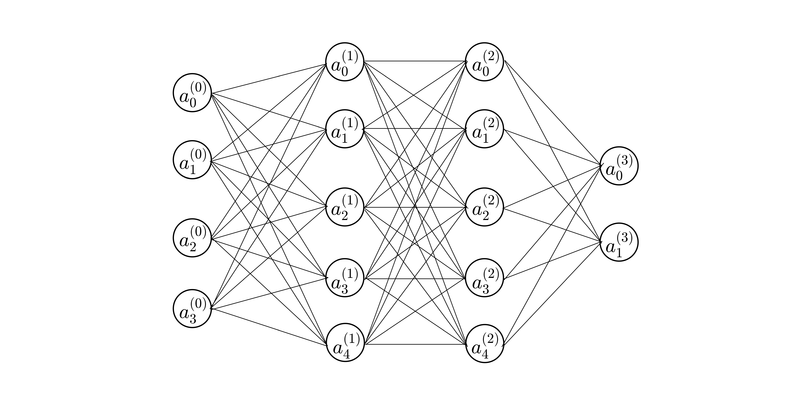

|  姓名  |     学号      |   班级   |
| :----: | :-----------: | :------: |
| 付清晨 | 0121618380615 | 机设1606 |

# 可选作业二

构建一个四层的BP人工神经网络，不少于16个神经元结点，自定义一个样本，模拟计算一次完整的样本训练过程，整个过程必须包括各个神经元结点的输入值、输出值以及反馈过程中对权向量的修改情况。

## 构建的网络

其中：

- 输入层 $a^{(0)}=\left[4\ 3\ 2\ 1 \right]^T$
- 权重 $w^{(1)}=\left[
  \begin{matrix}
  0.01 & 0.06 & 0.11 & 0.16\\
  0.02 & 0.07 & 0.12 & 0.17\\
  0.03 & 0.08 & 0.13 & 0.18\\
  0.04 & 0.09 & 0.14 & 0.19\\
  0.05 & 0.10 & 0.15 & 0.20\\
  \end{matrix}
  \right],w^{(2)}=\left[
  \begin{matrix}0.21 & 0.22 & 0.23 &0.24 & 0.25\\
  0.16 & 0.17 & 0.18 &0.19 & 0.20\\
  0.11 & 0.12 & 0.13 &0.14 & 0.15\\
  0.06 & 0.07 & 0.08 & 0.09 & 0.10\\
  0.01 & 0.02 & 0.03 & 0.04 & 0.05\\\end{matrix}
  \right],w^{(3)}=\left[
  \begin{matrix}
  0.16 & 0.17 & 0.18 & 0.19 & 0.20\\0.21 & 0.22 & 0.23 & 0.24 & 0.25\\
  \end{matrix}
  \right]$
- 期望输出层 $y^{(3)}=[0.10\ 0.24]^T$  
- 每个节点没有偏置
- 节点激活函数 $\sigma(x)=1/{(1+e^{-x})}$，导数$\sigma'(x)=\sigma(x)(1-\sigma(x))$

## 符号说明

- $a_i^{(L)}$：第 (L) 层节点的第 i 个元素的 **输出值**
-  $z_i^{(L)}$：第 (L) 层节点的第 i 个元素的 **输入值**
- $w_{ij}^{(L)}$：第 (L-1) 层 的第 i 个节点 到 第 (L) 层 的第 j 个节点的 **权重** 

## 正向传播

### 0层→1层

第一层输入值为：
$$
z^{(1)}=\left[
\begin{matrix}
z_0^{(1)} \\
z_1^{(1)} \\
z_2^{(1)} \\
z_3^{(1)} \\
\end{matrix}
\right]=w^{(1)}a^{(0)}=\left[
\begin{matrix}
w_{00}^{(1)} & w_{01}^{(1)} & w_{02}^{(1)} & w_{03}^{(1)}\\
w_{10}^{(1)} & w_{11}^{(1)} & w_{12}^{(1)} & w_{13}^{(1)}\\
w_{20}^{(1)} & w_{21}^{(1)} & w_{22}^{(1)} & w_{23}^{(1)}\\
w_{30}^{(1)} & w_{31}^{(1)} & w_{32}^{(1)} & w_{33}^{(1)}\\
w_{40}^{(1)} & w_{41}^{(1)} & w_{42}^{(1)} & w_{43}^{(1)}\\
\end{matrix}
\right]·\left[
\begin{matrix}
a_0^{(0)} \\
a_1^{(0)} \\
a_2^{(0)} \\
a_3^{(0)} \\
\end{matrix}
\right]\\=\left[
\begin{matrix}
0.01 & 0.06 & 0.11 & 0.16\\
0.02 & 0.07 & 0.12 & 0.17\\
0.03 & 0.08 & 0.13 & 0.18\\
0.04 & 0.09 & 0.14 & 0.19\\
0.05 & 0.10 & 0.15 & 0.20\\
\end{matrix}
\right]·\left[
\begin{matrix}
4\\
3\\
2\\
1\\
\end{matrix}
\right]=\left[
\begin{matrix}
0.6\\
0.7\\
0.8\\
0.9\\
1.0\\
\end{matrix}
\right]
$$

第一层输出值为：
$$
a^{(1)}=\left[
\begin{matrix}
a_0^{(1)} \\
a_1^{(1)} \\
a_2^{(1)} \\
a_3^{(1)} \\
\end{matrix}
\right]=\sigma\left(z^{(1)}\right)=\sigma\left(\left[
\begin{matrix}
6\\
7\\
8\\
9\\
10\\
\end{matrix}
\right]\right)=\left[
\begin{matrix}
0.6457\\
0.6682\\
0.6900\\
0.7109\\
0.7311\\
\end{matrix}
\right]
$$

### 1层→2层

第二层输入值为：
$$
z^{(2)}=\left[
\begin{matrix}
z_0^{(2)} \\
z_1^{(2)} \\
z_2^{(2)} \\
z_3^{(2)} \\
z_4^{(2)} \\
\end{matrix}
\right]=w^{(2)}a^{(1)}=\left[
\begin{matrix}
w_{00}^{(2)} & w_{01}^{(2)} & w_{02}^{(2)} & w_{03}^{(2)} & w_{04}^{(2)}\\
w_{10}^{(2)} & w_{11}^{(2)} & w_{12}^{(2)} & w_{13}^{(2)} & w_{04}^{(2)}\\
w_{20}^{(2)} & w_{21}^{(2)} & w_{22}^{(2)} & w_{23}^{(2)} & w_{04}^{(2)}\\
w_{30}^{(2)} & w_{31}^{(2)} & w_{32}^{(2)} & w_{33}^{(2)} & w_{04}^{(2)}\\
w_{40}^{(2)} & w_{41}^{(2)} & w_{42}^{(2)} & w_{43}^{(2)} & w_{04}^{(2)}\\
\end{matrix}
\right]·\left[
\begin{matrix}
a_0^{(1)} \\
a_1^{(1)} \\
a_2^{(1)} \\
a_3^{(1)} \\
a_4^{(1)} \\
\end{matrix}
\right]\\=\left[
\begin{matrix}
0.21 & 0.22 & 0.23 &0.24 & 0.25\\
0.16 & 0.17 & 0.18 &0.19 & 0.20\\
0.11 & 0.12 & 0.13 &0.14 & 0.15\\
0.06 & 0.07 & 0.08 & 0.09 & 0.10\\
0.01 & 0.02 & 0.03 & 0.04 & 0.05\\
\end{matrix}
\right]·\left[
\begin{matrix}
0.6457\\
0.6682\\
0.6900\\
0.7109\\
0.7311\\
\end{matrix}
\right]=\left[
\begin{matrix}
0.7947\\
0.6224\\
0.4501\\
0.2778\\
0.1055\\
\end{matrix}
\right]
$$
第二层输出值为：
$$
a^{(2)}=\left[
\begin{matrix}
a_0^{(2)} \\
a_1^{(2)} \\
a_2^{(2)} \\
a_3^{(2)} \\
\end{matrix}
\right]=\sigma\left(z^{(2)}\right)=\sigma\left(\left[
\begin{matrix}
0.7947\\
0.6224\\
0.4501\\
0.2778\\
0.1055\\
\end{matrix}
\right]\right)=\left[
\begin{matrix}
0.6888\\
0.6508\\
0.6107\\
0.5690\\
0.5264\\
\end{matrix}
\right]
$$

### 2层→3层

第三层输入值为：
$$
z^{(3)}=\left[
\begin{matrix}
z_0^{(3)} \\
z_1^{(3)} \\
\end{matrix}
\right]=w^{(2)}a^{(1)}=\left[
\begin{matrix}
w_{00}^{(3)} & w_{01}^{(3)} & w_{02}^{(3)} & w_{03}^{(3)} & w_{04}^{(3)}\\
w_{10}^{(3)} & w_{11}^{(3)} & w_{12}^{(3)} & w_{13}^{(3)} & w_{04}^{(3)}\\
\end{matrix}
\right]·\left[
\begin{matrix}
a_0^{(2)} \\
a_1^{(2)} \\
a_2^{(2)} \\
a_3^{(2)} \\
a_4^{(2)} \\
\end{matrix}
\right]\\=\left[
\begin{matrix}
0.16 & 0.17 & 0.18 & 0.19 & 0.20\\
0.21 & 0.22 & 0.23 & 0.24 & 0.25\\
\end{matrix}
\right]·\left[
\begin{matrix}
0.6888\\
0.6508\\
0.6107\\
0.5690\\
0.5264\\
\end{matrix}
\right]=\left[
\begin{matrix}
0.5441\\
0.6964\\
\end{matrix}
\right]
$$
第三层输出值为：
$$
a^{(3)}=\left[
\begin{matrix}
a_0^{(3)} \\
a_1^{(3)} \\
\end{matrix}
\right]=\sigma\left(z^{(2)}\right)=\sigma\left(\left[
\begin{matrix}
0.7947\\
0.6224\\
\end{matrix}
\right]\right)=\left[
\begin{matrix}
0.6328\\
0.6674\\
\end{matrix}
\right]
$$

### 损失

$$
C=\sum\limits_i\frac12(y_i-a_i)^2\\=\frac 12(0.6328-0.10)^2+\frac 12(0.6674-0.24)^2=0.2332
$$

## 反向传播

