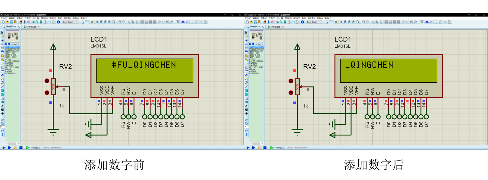
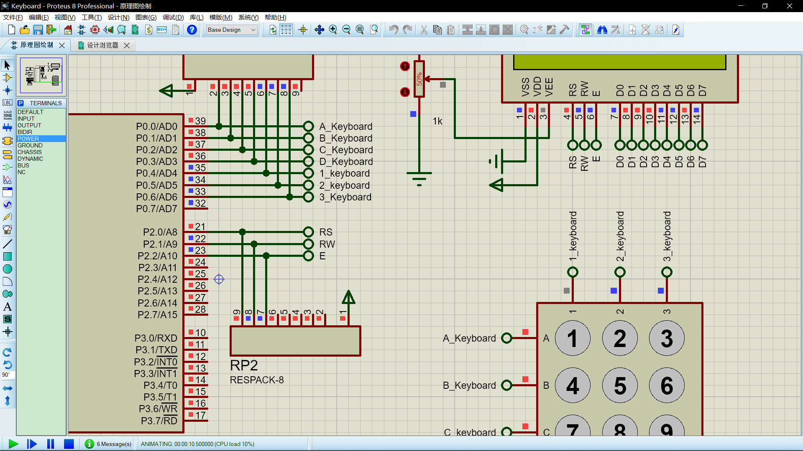
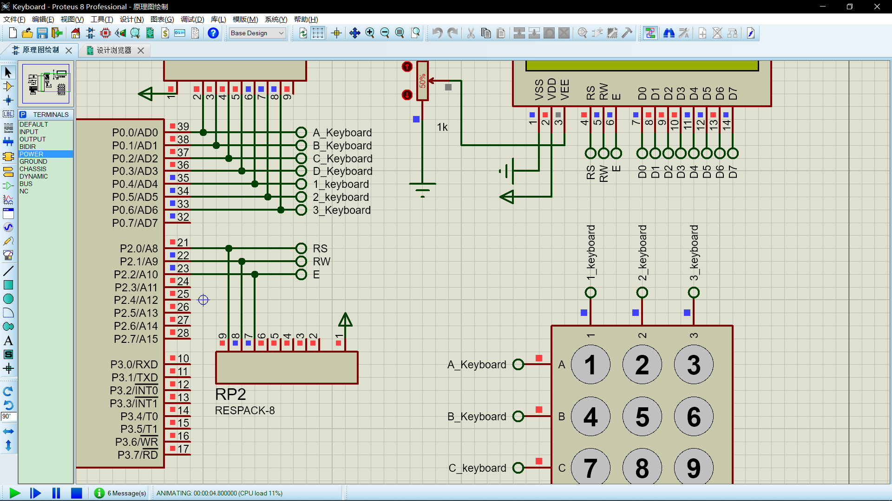

# 实验要求

设计一个模拟电话拨号的显示装置，即把电话键盘中拨出的某一电话号码， 显示在LCD显示屏上。电话键盘共有12个键，除了0~9的10个数字键外，还有“*”键用于实现删除功能，即删除位最后输人的号码;“#” 键用于清除显示屏上所有的数字显示。还要求每按下一个键要发出声响，以表示按下该键。

# 实验原理

本题目涉及单片机与4x 3矩阵式键盘的接口设计以及与16x 2的液晶显示屏的接口设计，以及如何驱动蜂鸣器。液晶显示屏采用LM016L(LCD1602)LCD,显示共2行，每行16个字符。第1行为设计者信息，第2行开始显示所拨的电话号码，最多为16位(因为LCD的-行能显示16个字符)。

# 系统电路的设计

要求包括内容：电路原理图，电子元器件型号和数量表格，电路工作原理的重点说明。

# 系统控制程序的设计

要求包括内容：控制程序的工作流程图，控制程序的源代码，及其控制程序的重点说明。

# 系统的调试和结果

要求包括内容：系统调试的方法，系统正确运行的照片或图片(必须包括整个工作过程的图片)并作简要说明。

# 实验过程中所遇到的问题，解决方法和建议

##   【C语言语法】变量的申明

### 问题

我一开始的循环是这样写的：

```c
for (int i = 0; i < length; i++){
    //Do Some Thing
}
```

但是我发现标准C语言不支持不支持临时变量在for循环中定义

### 解决方法

在函数的开始申明变量，之后再使用变量

```c
int i;
for (i = 0; i < length; i++){
    //Do Some Thing
}
```
## 【LCD1602】显示器字符的去除

### 问题

写字符串的函数

```c
/*************************************************
* @Description: LCD1602显示字符串
* @Input: address:字符串位置;*s:字符串;length:字符串长度
*************************************************/
void show_string_LCD(unsigned char address, unsigned char *s, unsigned int length) {
	unsigned int i;
	write_command_LCD(address);
	delay(5);
	for (i = 0; i < length; i++)
	{
		write_data_LCD(*(s + i));
	}
}
```

只能对LCD1602上面的字符进行改变，但是无法删除。

### 解决方法

当有删除字符的操作时，先**清除屏幕内容**，再**加载删除后的内容**。

## 【LCD1602】屏幕的移动

### 问题

按照课本上的代码，每当我输入一个字符时，整个屏幕都会向左移动。但是按照要求，第1行为设计者信息，这个是不希望移动的，第二行是可以移动的



### 解决方法

在LCD1602初始化时，**设置为整屏不移动**，以保持第一行正常移动；记录每次输入值，**通过软件算法给出需要显示在LCD上的数字**，实现第二排的移动。

- 更改LCD1602初始化设置

  ```c
  /*************************************************
  * @Description: LCD1602初始化
  *************************************************/
  void initial_LCD() {
  	write_command_LCD(0x38);	//两行显示，5*7点阵，8位数据接口
  	_nop_();
  	write_command_LCD(0x0C);	//整体显示，光标关，无显示
  	_nop_();
  	write_command_LCD(0x04);	//整屏不移位
  	_nop_();
  	write_command_LCD(0x01);	//显示清屏
  }
  ```

- 通过软件算法给出需要显示在LCD第二排的内容

  ```c
  /*************************************************
  * @Description: 根据输入在LCD上的操作
  * @Input: no:读取的键盘字符[0,1,2,3,4,5,6,7,8,9,*,#]
  *************************************************/
  void get_No(int no) {
  	char str2;
  	if (no < 10)	//输入数字时，加一位数字
  	{
  		str2 = no + 48;	//将no给str2,48为ASCII码
  		if (strlen(str)<16)
  		{
  			strcat(str, &str2);	//加一位数字
  		}
  	}
  	else if (no == 10)	//输入 * 时，去一位数字
  	{
  		write_command_LCD(0x01);	//显示清屏
  		delay(5);
  		show_string_LCD(0x82, "#FU_QINGCHEN", 12);
  		*(str + strlen(str) - 1) = 0;
  		*(str + strlen(str)) = 0;
  	}
  	else    //输入 # 时，清屏
  	{
  		*str = 0;
  		write_command_LCD(0x01);	//显示清屏
  		delay(5);
  		show_string_LCD(0x82, "#FU_QINGCHEN", 12);
  		_nop_();
  		delay(500);
  	}
  	show_string_LCD(0xC0, str, strlen(str));
  	delay(5);
  }
  ```

## 【Proteus】接口序号

### 问题

按照电路图， `1_keyboard ` 引脚应该为低电平。但是测试时出现了 `1_keyboard ` 引脚点位不明确的现象



### 解决方法

将`AT89C51`上的接口名称由`1_keyboard` 改为`1_keyboard ` (在后面多一个空格)



