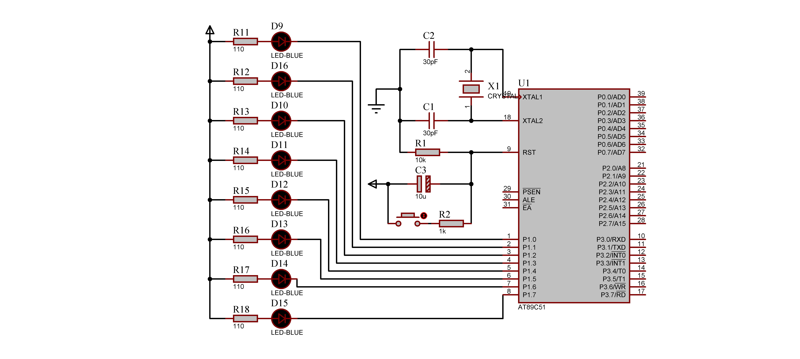
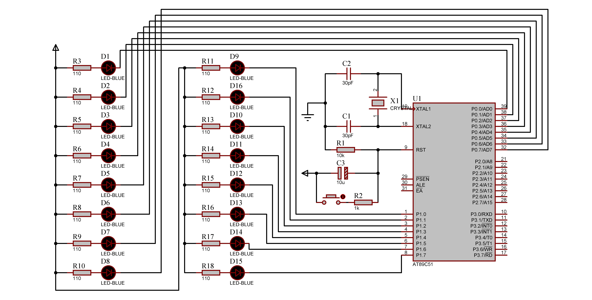
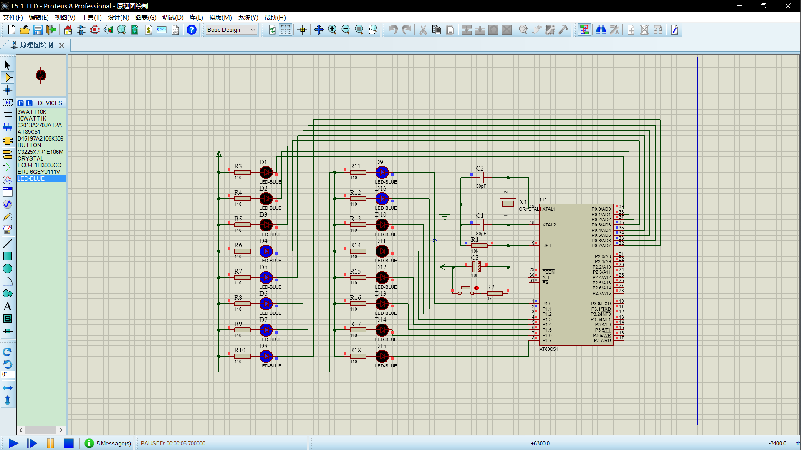

|  姓名  |     学号      |   班级   |
| :----: | :-----------: | :------: |
| 付清晨 | 0121618380615 | 机设1606 |

[TOC]

# 问题描述

发光二极管可以用来指示系统的工作状态，制作节日彩灯、广告牌匾等等。

# 硬件模块



- 时钟电路：包含 `C1`、`C2`、`X1`、`R1`
- 复位电路：包含按钮、 `R2`、`C3`
- 主要电路：8个发光二极管并联，接在`P1` 接口

# 软件模块

## 关键代码

- 延时函数

```c
void delay(uint i){
	uchar t;
	while(i--){
		for(t = 0;t<120;t++);
	}
}
```
- 位运算

```c
P1 = _crol_(P1,1);
```

# 拓展: 变速亮灯

## 问题描述

课本上的例题中，LED灯点亮的是随着时间均匀点亮的。在现实生活中，物体照着一定节奏移动，并不是一开始就移动很快的。我弄的就是让LED小灯随着时间的变化不均匀点亮，给人一种加速减速的感觉。


> 如图为随着时间的增加，对应点亮的LED灯的序号。横坐标表示一次循环的进行程度（0为循环开始，1为循环结束），纵坐标表示灯的序号。
>
> 直线为课本例题的情况，两条曲线为本报告中的亮灯情况，**夹在两曲线之间的灯点亮**，其余熄灭

## 硬件模块



- 时钟电路：包含 `C1`、`C2`、`X1`、`R1`
- 复位电路：包含按钮、`R2`、`C3`
- 主要电路：16个发光二极管并联，接在与`P0`、`P1` 接口

> 单片机和课本选的一样的，都是AT89C51

## 软件模块

### 关键代码

- 控制开灯

  利用了 `&` 运算符来控制特定灯开启 

  例如要想P0口的第三个灯开
  $$
  \ \ \ 1110\ 0111\\
  \&1111\ 1011\\
  =11100011
  $$

  这样灯就开了

  ```c
  uint D[8] = {0xFE,0xFD,0xFB,0xF7,0xEF,0xDF,0xBF,0x7F}; 
  //每个灯的代号，用于后面的逻辑运算
  *(P) &= D[speed];
  ```

- 控制关灯

  利用了 `|`  运算符来控制哪个灯开启 

  例如要想P1口的第三个灯关
  $$
  \ \ \ \ \ 1110\ 0011\\
  \ \ \ |\ 0000\ 0100\\
  =1110\ 0111
  $$
  这样灯就关了

  ```c
  uint D[8] = {0xFE,0xFD,0xFB,0xF7,0xEF,0xDF,0xBF,0x7F};
  //每个灯的代号，用于后面的逻辑运算
  *(P + 1) |= (~D[speed]);
  ```

### 源代码

```c
/**************************************************************************
  * @brief           : C51 LED变速亮灯
  * @author        : fuqingchen@whut.edu.cn
  * @data  				 : 2018-10-13
***************************************************************************/
#include <reg51.h>
#include <intrins.h>
#include <math.h>
#define uchar unsigned char //刚好8位
#define uint unsigned int
#define N 16 //LED灯的数量
#define Loop 50 //控制一次循环采样次数

void delay(uint i){ //抄的课本上的
	uchar t;
	while(i--){
		for(t = 0;t<120;t++);
	}
}

/*
控制开灯
输入：i 时间（循环次数）；P 各个接口的状态
返回灯的序号
*/
void light(uint i,uint *P) {
	uint D[8] = {0xFE,0xFD,0xFB,0xF7,0xEF,0xDF,0xBF,0x7F}; 
    //每个灯的代号，用于后面的逻辑运算
	uint speed = N*pow(i*1.0/Loop,0.5); //开灯的函数(上图曲线的函数)
	//return N*pow(i*1.0/Loop,1); //这是课本例题的函数
	if (speed < 8) {
		*(P) &= D[speed]; //P0
	}else{
		*(P+1) &= D[speed - 8];  //P1
	}
}

/*
控制关灯
输入：i 时间（循环次数）；P 各个接口的状态；
返回灯的序号
*/
void unlight(uint i,uint *P) {
	uint D[8] = {0xFE,0xFD,0xFB,0xF7,0xEF,0xDF,0xBF,0x7F};
    //每个灯的代号，用于后面的逻辑运算
	uint speed = N*pow(i*1.0/Loop,2); //关灯的函数(上图曲线的函数)
    //return N*pow(i*1.0/Loop,1); //这是课本例题的函数
	if (speed < 8) {
		*(P) |= (~D[speed]); //P0
	}else{
		*(P+1) |= (~D[speed - 8]); //P1
	}
}

void main(){
	uint temp[2] = {0xFE,0xFF};
	uint j = 1;
	while(1){
		P0 = temp[0];
		P1 = temp[1];
		for (; j <= Loop; j++) {
			delay(50);
			light(j,temp);
			unlight(j,temp);
			P0 = temp[0];
			P1 = temp[1];
		}
		temp[0] = 0xFE; //我不知道怎么一次给一个数组全赋值，然后就分开写了
		temp[1] = 0xFF;
		j = 1;
	}
}
```

## 调试模块



与所期望的图像相同

> 这个应该竖着排的，但是竖着排就超过这个方框了

> 不过这个有问题，仿真显示`D2`灯只能在第一次点亮，而不能在以后点亮。。。

------

2018-10-16