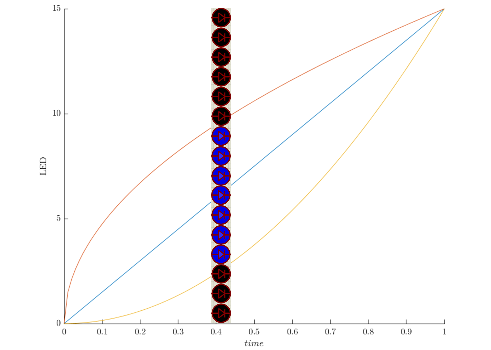

机设1606付清晨	0121618380615

------

# C51单片机LED变速亮灯

## 1.介绍

课本上的例题中，LED灯点亮的是随着时间均匀点亮的。在现实生活中，物体照着一定节奏移动，并不是一开始就移动很快的。我弄的就是让LED小灯随着时间的变化不均匀点亮，给人一种加速减速的感觉。



> 如图为随着时间的增加，对应点亮的LED灯的序号。横坐标表示一次循环的进行程度（0为循环开始，1为循环结束），纵坐标表示灯的序号。
>
> 直线为课本例题的情况，两条曲线为本报告中的亮灯情况，夹在两曲线之间的灯点亮，其余熄灭

## 2.电路设计


> 单片机和课本选的一样的，都是AT89C51

## 3.程序设计

```c
/**************************************************************************
  * @brief           : C51 LED变速亮灯
  * @author        : fuqingchen@whut.edu.cn
  * @data  				 : 2018-10-13
***************************************************************************/

#include <reg51.h>
#include <intrins.h>
#include <math.h>
#define uchar unsigned char //不知道这个玩意有什么意义
#define uint unsigned int
#define N 16 //LED灯的数量
#define Loop 50 //控制一次循环采样次数

void delay(uint i){ //抄的课本上的
	uchar t;
	while(i--){
		for(t = 0;t<120;t++);
	}
}

/*
控制开灯
输入：i 时间（循环次数）；P 各个接口的状态
返回灯的序号
*/
void light(uint i,uint *P) {
	uint D[8] = {0xFE,0xFD,0xFB,0xF7,0xEF,0xDF,0xBF,0x7F};
	uint speed = N*pow(i*1.0/Loop,0.5); //开灯的速度
	//return N*pow(i*1.0/Loop,1); //这是课本例题的速度
	if (speed < 8) {
		*(P) &= D[speed]; //P0
	}else{
		*(P+1) &= D[speed - 8];  //P1
	}
}

/*
控制关灯
输入：i 时间（循环次数）；P 各个接口的状态；
返回灯的序号
*/
void unlight(uint i,uint *P) {
	uint D[8] = {0xFE,0xFD,0xFB,0xF7,0xEF,0xDF,0xBF,0x7F};
	uint speed = N*pow(i*1.0/Loop,2); //关灯的速度
	if (speed < 8) {
		*(P) |= (~D[speed]); //P0
	}else{
		*(P+1) |= (~D[speed - 8]); //P1
	}
}

void main(){
	uint temp[2] = {0xFE,0xFF};
	uint j = 1;
	while(1){
		P0 = temp[0];
		P1 = temp[1];
		for (; j <= Loop; j++) {
			delay(50);
			light(j,temp);
			unlight(j,temp);
			P0 = temp[0];
			P1 = temp[1];
		}
		temp[0] = 0xFE; //我不知道怎么一次给一个数组全赋值，然后就分开写了
		temp[1] = 0xFF;
		j = 1;
	}
}
```

------

2018-10-14