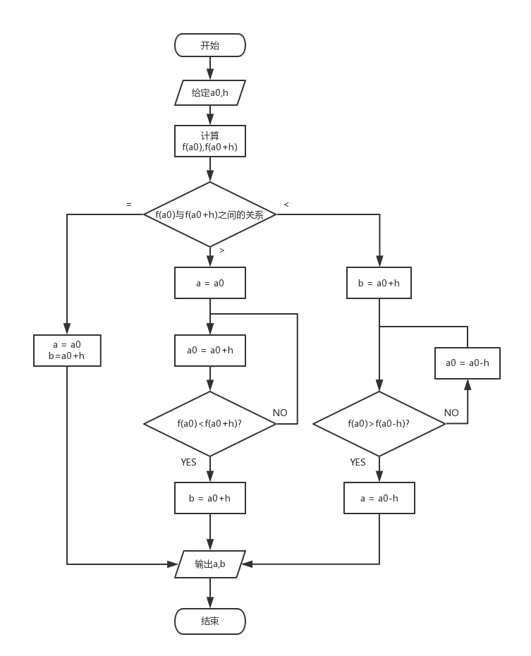

# 进退法

在单态区间内，找到三个点 $x_1,x_2,x_3$ 使得 $f(x_1)>f(x_2),f(x_3)>f(x_2)$ ，这样最小点就在区间 $(x_1,x_3)$ 内

## 程序框图



## 源代码

```c
/*************************************************
* @Author: Fu_Qingchen
* @Date: 2018-11-7 
* @Description: 进退法求解区间
*************************************************/
#include<stdio.h>
#include<stdlib.h>
#define A 0
#define H 1

/*************************************************
* @Description: 要找区间的函数
*************************************************/
double function(double x) {
	return (x * x + 15 * x + 1);
}

/*************************************************
* @Description: 进退法主函数
* @Input: a0:初始值,h:步长,*range:区间左右端点
* @Return: 区间左右端点
*************************************************/
void jintui(double a0, double h, double *range) {
	if (function(a0)==function(a0+h))
	{
		*(range) = a0;
		*(range + 1) = a0 + h;
	}
	else if (function(a0) > function(a0 + h))
	{
		*(range) = a0;
		do
		{
			a0 += h;
		} while (function(a0)>function(a0 + h));
		*(range + 1) = a0 + h;
	}
	else
	{
		*(range + 1) = a0 + h;
		do
		{
			a0 -= h;
		} while (function(a0)<function(a0 + h));
		*(range) = a0 - h;
	}
}

void main() {
	double a0 = A, h = H;
	double range[2] = {0,0};
	jintui(a0, h, range);
	printf("Result:%f,%f\n", range[0], range[1]);
	system("pause");
}
```

