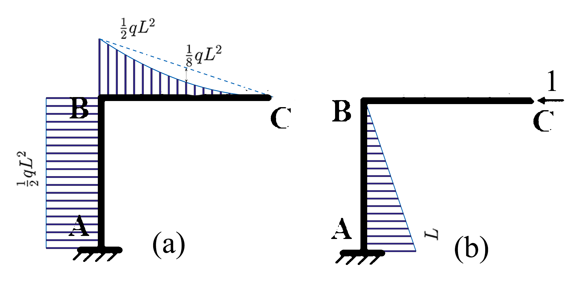
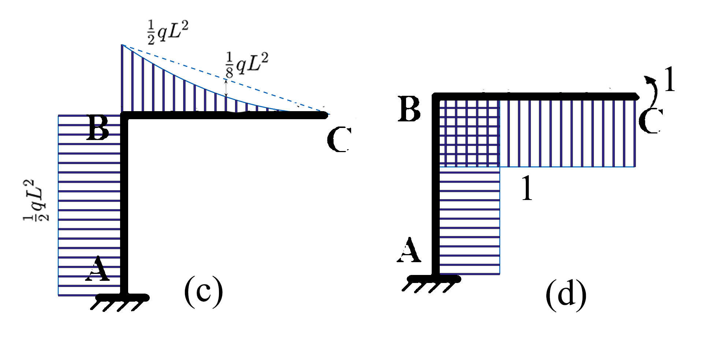

# Unit load method for displacement calculation.

Determine the horizontal displacment of Point C; and the angular displacement of the cross section at Point C.

## Solution:

###  The horizontal displacment of Point C

Picture A is real state. Picture B is a fictious state that a unit horizontal force $F=1$ is applied at pointC 

$$
\Delta_{CH}=\sum \frac 1{EI}·y·\Omega=\frac 1{EI}y_{AB}\Omega_{AB}+\frac 1{EI}y_{BC}\Omega_{BC}\\=\frac1{EI}(-\frac12qL^2·L·\frac L2+0)=\frac{qL^4}{4EI}(\rightarrow)
$$

### the angular displacement of the cross section at Point C

Picture C is real state. Picture D is a fictious state that a unit bending momentt $M=1$ is applied at point C

$$
\varphi_{C}=\sum \frac 1{EI}·y·\Omega=\frac 1{EI}y_{AB}\Omega_{AB}+\frac 1{EI}y_{BC}\Omega_{BC}\\=\frac1{EI}(-\frac12qL^2·L·1-\frac13·\frac 12qL^2·L·1)=\frac{2qL^3}{3EI}(\circlearrowright)
$$

------

2018-10-23