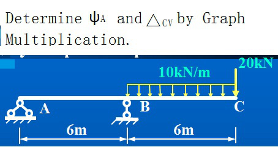
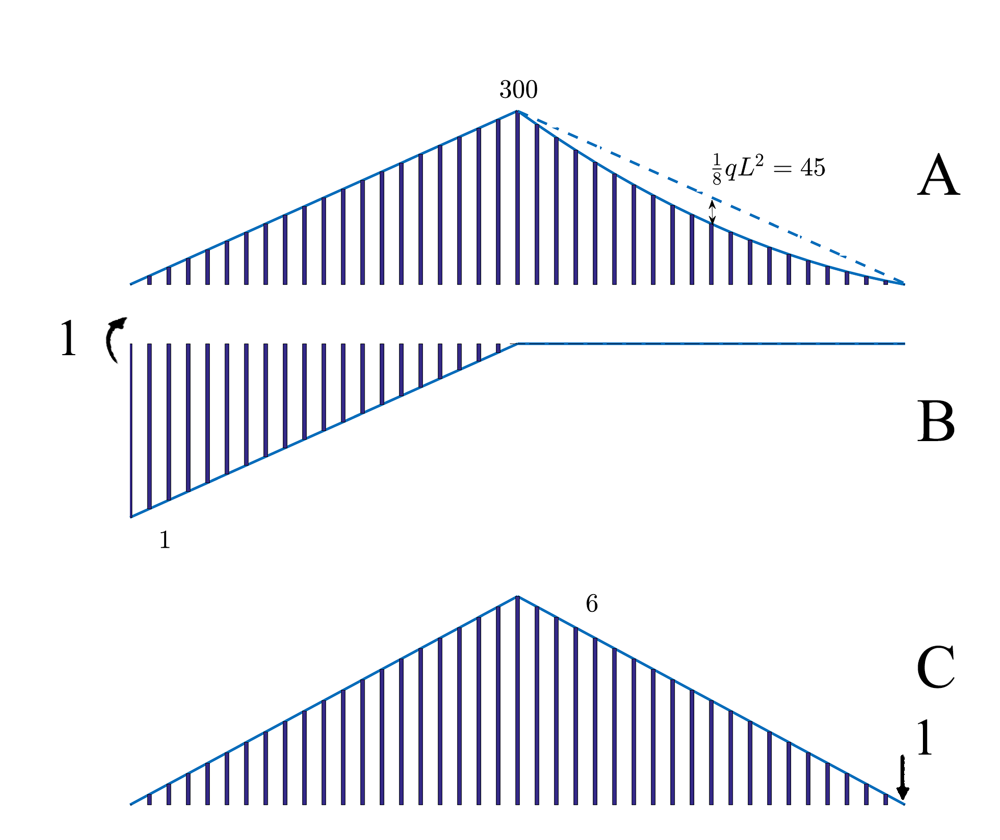

# Practise Graph Multiplication.

## Solution:

### The Angular displacement of the cross section at Point A

Picture A is real state. Picture B is a fictious state that a unit bending momente $M=1$ is applied at point A
$$
\varphi_{A}=\sum \frac 1{EI}·y·\Omega=\frac 1{EI}y_{AB}\Omega_{AB}+\frac 1{EI}y_{BC}\Omega_{BC}\\=\frac1{EI}(-\frac12·300·6·\frac{1}3+0)=\frac{300}{EI}(\circlearrowleft )
$$

###  The Vertical displacment of Point C

Picture A is real state. Picture C is a fictious state that a unit veitical force  $F=1$ is applied at point C
$$
\Delta_{CV}=\sum \frac 1{EI}·y·\Omega=\frac 1{EI}y_{AB}\Omega_{AB}+\frac 1{EI}y_{BC}\Omega_{BC}\\=\frac1{EI}(\frac12·6·6·\frac 23·300+\int_0^6\int(20+10x)dx·\frac{\int_0^6x\int (20+10x)dx}{\int_0^6\int(20+10x)dx})=\frac{6660}{EI}(\downarrow)
$$

------

2018-10-24