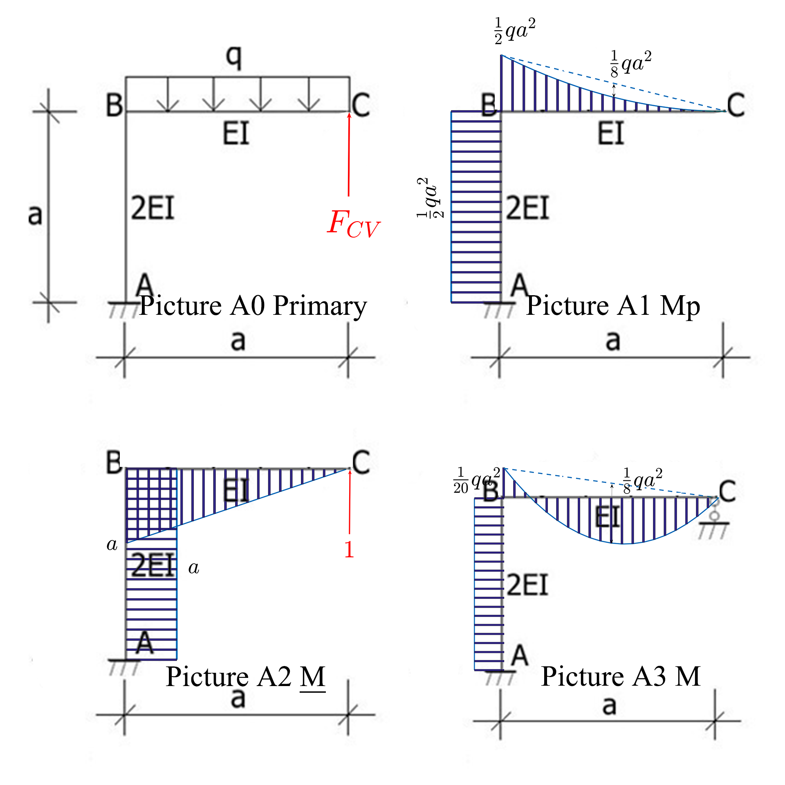
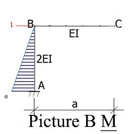

# Force Method

Determine the horizontal translation at Point

# Solution:

## Picture A is real state

### Determine the primary structure

The Frame is redundant with one DOF, Remove the  link support at Point C, the primary structure is shown as [Picture A0]

### Calculate the $\delta_{CC},\Delta_{CP}$

[Picture A1] is the primary structure with extra force, [Picture A2] is the primary structure with unit force at Point C

Using graph multipilication:
$$
\Delta_{CP}=\frac1{2EI}(\Omega_{AB}y_{AB})+\frac1{EI}(\Omega_{BC}y_{BC})\\
=-\frac1{2EI}(\frac12qa^2a·a)-\frac1{EI}(\frac13\frac12qa^2a·\frac34a)\\
=-\frac{3qa^4}{8EI}
$$

$$
\delta_{CP}=\frac1{2EI}(\Omega_{AB}y_{AB})+\frac1{EI}(\Omega_{BC}y_{BC})\\
=\frac1{2EI}(aa·a)+\frac1{EI}(\frac12aa·\frac23a)\\
=\frac{5a^3}{6EI}
$$

### Calculate the $F_{CV}$

$$
F_{CV}=-\frac{\Delta_{CP}}{\delta_{CC}}=\frac9{20}qa
$$

### Draw M diagram

the M diagram is shown as [Picture A3]

## Picture B is fictious state

Chose the primary structure as formal as before, add a unit horizontal force at the point B, shown as [picture B]

Using the graph multipilication:
$$
\Delta_{BH}=\frac1{2EI}(\Omega_{AB}y_{AB})+\frac1{EI}(\Omega_{BC}y_{BC})\\
=\frac1{2EI}(\frac12aa·\frac1{20}qa^2)+0\\
=\frac{qa^4}{80EI}
$$

------

2018-11-5, Fu_Qingchen